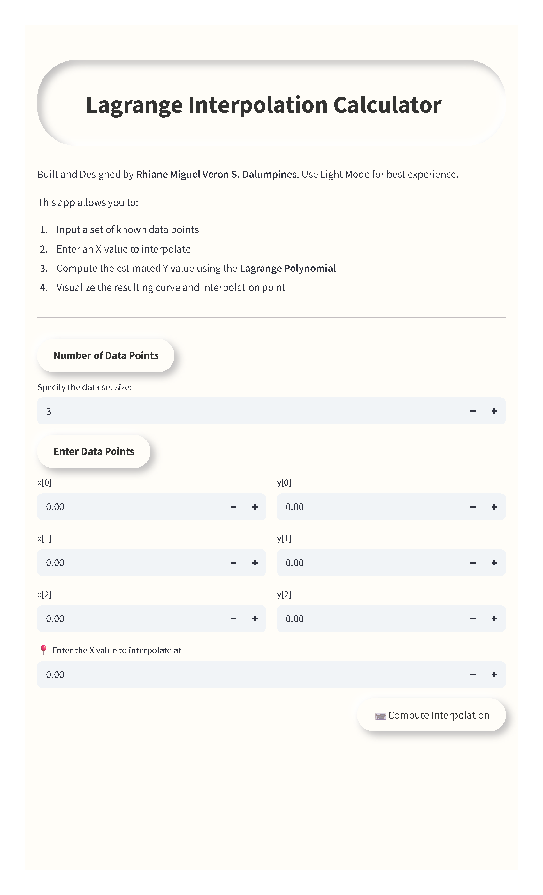
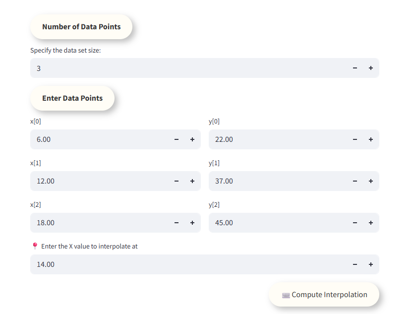
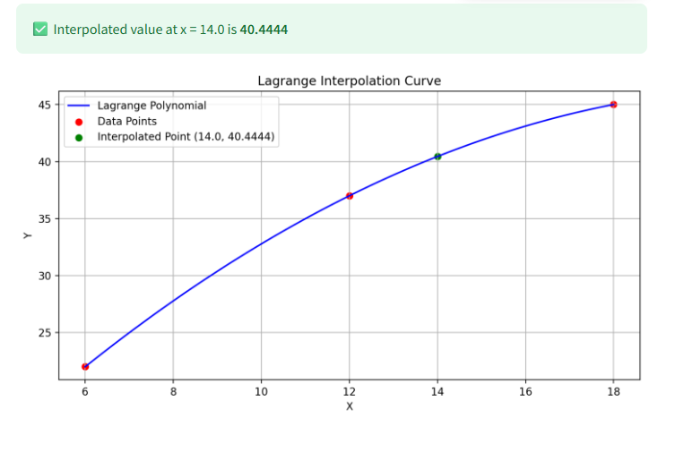

# &#10132; Lagrange Interpolation Calculator

A beautiful and interactive Streamlit web application to perform **Lagrange Polynomial Interpolation**. Designed with a soft **neumorphic UI**, this tool helps users input data points and compute estimated values with visual feedback.

---

## &#10132; Features

-  Input any number of known data points  
-  Enter an X-value to interpolate  
-  Calculates using **Lagrange Polynomial**  
-  Visualizes the curve and interpolation point  
-  Smooth neumorphic design for a modern UI experience  


## &#8258; About Lagrange Interpolation

Lagrange Interpolation is a polynomial interpolation method that estimates unknown values between known data points. The interpolating polynomial is constructed as:

<script type="text/javascript" async
  src="https://cdn.jsdelivr.net/npm/mathjax@3/es5/tex-mml-chtml.js">
</script>

$$
P(x) = \sum_{i=0}^{n} y_i \prod_{\substack{j=0 \\ j \ne i}}^{n} \frac{x - x_j}{x_i - x_j}
$$

### &#10132; Explanation:

- Each **term** in the sum represents a Lagrange basis polynomial \( L_i(x) \), multiplied by the corresponding \( y_i \).
- The product term

  $$
  \prod_{\substack{j=0 \\ j \ne i}}^{n} \frac{x - x_j}{x_i - x_j}
  $$

  constructs a polynomial that:
  - Is equal to 1 when \( x = x_i \)
  - Is equal to 0 when \( x = x_j \) for all \( j ≠ i \)
- The entire sum adds these scaled polynomials together, forming a unique curve that fits all the data points.


### &#10132; Limitations:

- Inefficient for a large number of points (due to recomputation).
- Susceptible to Runge’s phenomenon if the interval is large and points are unequally spaced.
- Not ideal for extrapolation beyond the known data range.

---

## &#8258; How to Run

To run this app on your local machine, follow these steps:

1. **Prepare Your Environment**

   - Make sure you have **Python 3.8+** installed.
   - Install **Streamlit** using pip:

     ```bash
     pip install streamlit
     ```

2. **Extract the Files**

   - Extract the `.rar` file you received into any folder on your computer.
   - Inside, you’ll find the Python source file (e.g., `app.py`) and any additional files needed.

3. **Run the Application**

   - Open a terminal or command prompt.
   - Navigate to the folder where the files were extracted.
   - Run the Streamlit app with the following command:

     ```bash
     streamlit run app.py
     ```

4. **Use the Application**

   - After running the command, a new tab should open in your web browser.
   - You can now interact with the Lagrange Interpolation Calculator.


---

## &#8984; Preview/Procedures

### 1. You will be greeted with this homepage. 


---
### 2. You will need to firstly specify the number of data points, next will be the specific data points, and lastly the t-value to interpolate at. 


---
### 3. After pressing the Compute Interpolation, a visualization of the result will be given.



---

## Built With

- [Streamlit](https://streamlit.io/) – For the interactive web interface  
- [Matplotlib](https://matplotlib.org/) – For plotting the interpolation graph  
- [NumPy](https://numpy.org/) – For numerical operations  
- Custom CSS – Neumorphic design aesthetics  

---

## Developer

**Rhiane Miguel Veron S. Dalumpines**

CPE - 2A

